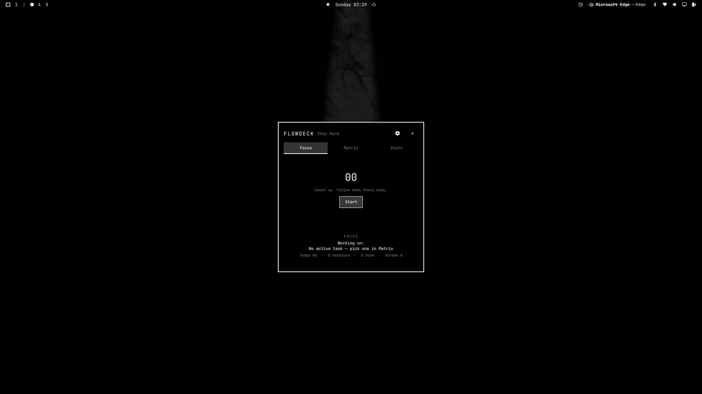

# Flowdeck

Pomodoro and Flowtime focus timers with an Eisenhower matrix and focus statistics,
native to the Omarchy bar.

- **Focus**: Pomodoro (25/5/15, long break every 4) and count-up Flowtime with
  interruptions and suggested breaks (traditional or proportional).
- **Matrix**: `Q1 DO | Q2 SCHEDULE | Q3 DELEGATE | Q4 DELETE` quadrants,
  single board, tasks linked to the timer. Completed tasks live in the
  `Completed` popup (with search); restoring returns the card to its quadrant.
- **Stats**: today grid, this-week bars, filterable session history, streak.
- **Settings**: timer durations, break policy, streak goal, notifications,
  export / import / reset — behind the gear icon.

State is persisted in versioned JSON at
`$XDG_DATA_HOME/flowdeck/state.json` (`~/.local/share/flowdeck/state.json`).
Timers are timestamp-based (`deadlineMs - Date.now()`), so they survive panel
close, shell reload, and suspend/resume.

## Preview



## Instalação

```bash
# Install via Omarchy plugin CLI (interactive: when asked for section, choose right)
omarchy plugin add https://github.com/yks777/Flowdeck.git --enable

# Restart shell so it can load
omarchy restart shell; sleep 6; omarchy-shell io.github.yks777.flowdeck ping
```

Non-interactive (sem prompt):

```bash
omarchy plugin add https://github.com/yks777/Flowdeck.git --enable --yes
omarchy plugin enable io.github.yks777.flowdeck --section right
omarchy restart shell; sleep 6; omarchy-shell io.github.yks777.flowdeck ping
```

> Não use apenas `add ... --enable --yes` e pare aí: com `--yes` o instalador
> pula a pergunta de placement e o widget não entra no `bar.layout`
> (somente service/panel habilitam — atalho e popup funcionam, mas sem relógio).
> Se o ícone sumir, repare com:
> `omarchy plugin enable io.github.yks777.flowdeck --section right`
> (se já existir entrada em `plugins[]` sem entrada na barra, remova a
> entrada de `plugins[]` antes ou o enable vira no-op) e reinicie a shell.

O widget fica na seção direita da barra; os timers continuam rodando porque a
entrada de serviço usa `keepLoaded`.

## Uninstall

```bash
omarchy plugin disable io.github.yks777.flowdeck
omarchy plugin remove io.github.yks777.flowdeck
omarchy restart shell
```

## Como funciona

### Atalhos

| Ação | Atalho / entrada |
| --- | --- |
| Alternar painel (abrir/fechar) | `Super+H` (padrão) |
| Fechar painel | `Esc` |
| Abrir / alternar painel | Clique esquerdo no widget da barra |
| Abrir estatísticas | Clique direito no widget da barra |
| Iniciar / pausar / retomar timer | Clique do meio no widget da barra |

Atalhos globais alternativos configuráveis: `Super+Shift+H`, `Alt+H`,
`Ctrl+Shift+H`.

### Operação via shell

```bash
omarchy-shell shell summon io.github.yks777.flowdeck '{"view":"matrix"}'
omarchy-shell shell hide io.github.yks777.flowdeck
omarchy-shell shell toggle io.github.yks777.flowdeck '{}'

# IPC direto do plugin (mesmo que Super+H executa)
omarchy-shell io.github.yks777.flowdeck togglePanel
omarchy-shell io.github.yks777.flowdeck focus
omarchy-shell io.github.yks777.flowdeck matrix
omarchy-shell io.github.yks777.flowdeck kanban   # alias legado para matrix
omarchy-shell io.github.yks777.flowdeck stats
omarchy-shell io.github.yks777.flowdeck status
omarchy-shell io.github.yks777.flowdeck today
omarchy-shell io.github.yks777.flowdeck isOpen
omarchy-shell io.github.yks777.flowdeck start
omarchy-shell io.github.yks777.flowdeck pause
omarchy-shell io.github.yks777.flowdeck stop
omarchy-shell io.github.yks777.flowdeck finish focus   # ou: finish break
omarchy-shell io.github.yks777.flowdeck interrupt
```

### Mouse na Matrix

Clique em um card para abrir suas ações:

- **Focus** — define a tarefa como ativa e inicia um timer (Pomodoro ou
  Flowtime, escolhido em Settings → Focus). Com um timer rodando, pede
  confirmação antes de trocar.
- **Done** — completa o card (marca conclusão, remove dos quadrantes).
  Reabra em `Completed`, que tem busca própria.
- **Edit** — renomeia inline (Enter salva, Esc cancela).
- **Delete** — pede confirmação.

Mova cards entre quadrantes com **arrastar**: segure o botão esquerdo em um
card (uma cópia fantasma segue o cursor), arraste sobre o quadrante alvo (ele
realça) e solte. Soltar fora de qualquer quadrante cancela. Quadrantes
rolam com a roda do mouse, arrastando espaços vazios, ou com a barra de
rolagem fina. `+ Add task` (em cada quadrante) cria inline.

## Dependencies

**QML / Quickshell:**
- `QtQuick`
- `QtQuick.Layouts`
- `QtQuick.Controls`
- `Quickshell`
- `Quickshell.Io`
- `Quickshell.Hyprland`
- `Quickshell.Wayland`
- `qs.Commons`
- `qs.Ui`

**Módulos JS internos:**
- `logic/Model.js`
- `logic/TimerEngine.js`
- `logic/StatsEngine.js`
- `logic/Storage.js`

**Comandos de shell usados:**
- `omarchy-notification-send`
- `canberra-gtk-play`
- `hyprctl`
- `omarchy`
- `bash`, `mkdir`, `cp`

Não há dependências externas de `npm`, `pip` ou `apt` além das APIs da
plataforma Omarchy / Quickshell.

## License

MIT — see [LICENSE](LICENSE).
